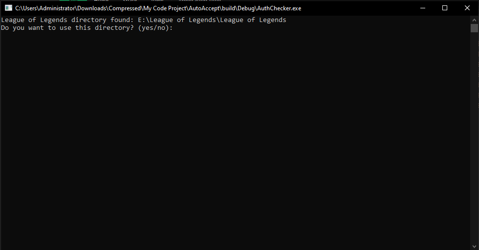

## League of Legends Auto Accept Queue

Welcome to the League of Legends Auto Accept Queue project! This C++ tool is designed to automate the process of accepting queue pop-ups in League of Legends.

## How It Works

League of Legends Auto Accept Queue is a C++ script/tool designed to automatically accept queue pop-ups in League of Legends. The tool works by continuously monitoring your game client for the appearance of the queue pop-up window. Once detected, it automatically accepts the queue, allowing you to swiftly enter into matches without having to manually accept each time.

## Features

* **Automated Queue Acceptance:** Automatically accepts queue pop-ups in League of Legends.
* **Lightweight:** The tool is designed to be lightweight and have minimal impact on system resources.
* **Easy to Use:** Simple setup and usage instructions provided.

## Usage

1. **Download the Tool:** Clone or download the repository to your local machine.
2. **Build the Project:** Use your preferred C++ compiler to build the project.
3. **Configure Settings:** Customize the settings file according to your preferences.
4. **Run the Executable:** Execute the compiled executable and let it run in the background while playing League of Legends.
5. **Enjoy:** Sit back and let the tool automatically accept queue pop-ups for you!

## Requirements

* C++ compiler (e.g., GCC, Clang, Visual Studio)
* League of Legends client running in the background

## Screenshots

## Demo

## Disclaimer

This tool is intended for educational and personal use only. I am not responsible for any misuse of this tool. Use it responsibly and ensure compliance with the terms of service of League of Legends.

## Contributing

Contributions are welcome! If you have any suggestions, feature requests, or bug reports, please feel free to open an issue or submit a pull request.

## License

This project is licensed under the MIT License.

## Contact

For any inquiries or support, you can reach out to orfox32@gmail.com.

Thank you for using League of Legends Auto Accept Queue (C++ Version)! Happy gaming! 🎮🚀
